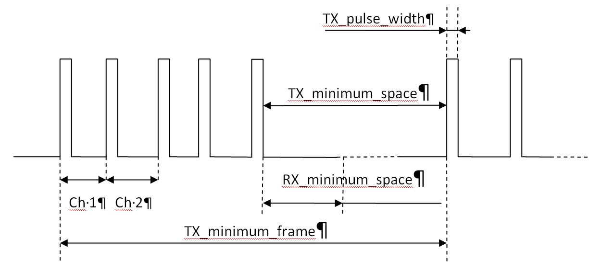

##  TBD 16 / 8 / 4 channels default values  
encoding / decoding


## Esp32_ppm
*Esp32_ppm* is a library that provides decoding and coding of PPM signals widely used in RC transmitters and receivers equipments.  
The library uses the **RMT (Remote Control Transceiver) peripheral** of the ESP32 and all output or input waveforms are managed by the hardware, requesting only a small load to the CPU.  
Specifically designed for the ESP32 family it has been tested on ESP32, ESP32C3, ESP32S3 and should run on all the processor of the family. (ESP32 Arduino core 3.2.0)   
Depending on the ESP32 model, up to 8 PPM streams can be managed on the same processor.  
 ESP32: 8 streams (RX or TX); ESP32C3: 2 RX, 2 TX; ESP32S3: 4 RX, 4 TX.  

## Usage: 
### Transmitting PPM Encoded Signals 
**ppmWriter(optional_polarity)**   
Create an oject for the generation of a PPM stream.   
Polarity must be RISING or FALLING . (default is RISING)  

`ppmWriter monPPM_TX; // create a PPM stream, with positive rising edge start impulsion`   

**begin(txPin, nbr_TX_Channels )**  
Initialize the PPM stream generated on GPIO tx_pin, with nbr_TX_Channels channels. (default is 4).  ???????????????????????????????????   
The generation of the pulses must be started effectively with **start()** or **startTest()**.   
The method returns a pointer to an array of integers where the user updates the values of each channel in microseconds (us).  
Returns NULL if an error occurs.
```
int* ppmArrayTX;
ppmArray = monPPM_TX.begin(19, 8);  // 8 channels ppm stream on pin 19
…
ppmArray[1] = 1200;	//	value for channel 1
ppmArray[2] = 1300;	//	value for channel 2
…
```
Channel numbering is from 1 to n and index 0 of the array is not used.  
The new value is immediately used for the next ppm frame.
No checks are made upon the values of the ppm channels. (usual values are between 1000 and 2000 us …)  
**start()**   
start the PPM generation.    
**startTest()**	  
start the PPM generation for test purpose: 
* in each PPM frame, the value of each channel is the same.  
* This value is incremented for each frame, changing from 1000us to 1999us and so on.

**stop()**  
  stop the PPM generation. It can be resumed with **start()** or **starTest()**  
**end()**  
  stop the PPM generation and free resources. The PPM stream must be reinitialized with a **begin(….)** before use.  
**sentFrame()**   
return a long unsigned int  time stamp (in us) of the last sent frame (value of micros() ) and reset the value to 0.  
Return 0 if the application already queries **sentFrame()** for the same frame.  
This function can be used to synchronize the application if need be.

### Receiving PPM Encoded Signals
**ppmReader ()**   
Create a PPM object stream for decoding an incoming stream of ppm frames.  

`ppmReader monPPM_RX; // create an incoming  PPM stream for decoding`  

**begin(rxPin,nbr_RX_Channels)**   
Initialize the PPM stream decoder on GPIO rx_pin, with nbr_RX_Channels channels (default is yyyyyyyyyyyyy).  
 Decoding of the pulses must be started effectively with **start()**.  
The method returns a *pointer to an array of integers* where the user can read the values of each channel in microeconds (us).  
 Returns NULL if an error occurs.  
Channel numbering is from 1 to n. 
Index 0 of the array gives the number of decoded channels.
```
int* ppmArrayRX;
ppmArray = monPPM_RX.begin(19, 8); // receiving 8 chanels frame on pin 19                8  ?????????????????????????
monPPM_RX.start();
…
for (int I =1; i< ppmArray[0];i++) Serial.printf(“%d  “, ppmArray[i]);
…
```
Update of this array is done asynchronously in respect of the main user task and will always reflect the last received values.   

**start()**  
start the PPM decoding.  
**stop()**  
stop the PPM generation. It can be resumed with **start()**.  
**end()**  
stop the PPM decoding and free resources. The PPM stream must be reinitialized with a **begin(….)** before use.   
**newFrame()**  
returns a *long unsigned int*  time stamp (in us) of the last received frame (value of micros() ) and reset the value to 0.  
Return 0 if the application already queries **newFrame()** for the same frame.  
This function can be used to synchronize the application if need be.  


## Fine tunning

Usual RC PPM signal timing is with a start pulse (300us) and an overall frame length arround 20ms (frequency 50hz). Channel values are between 1000us and 2000us.  
By default the library uses this “standard” and it should satisfy most users.   
Nevertheless fine tuning is available and the user can change some specific values through public variables of the class  

  

All values are in microseconds (us).  
## For receiver:  
**RX_minimum_space**  
for the decoder, a level longer than this value will be interpreted as the end of a frame (default is 3500us).
## For encoder:
**TX_pulse_width**   
length of the positive or negative pulse used for channel end/start (default is 300us ).  
**TX_minimum_space**  
minimum space between 2 frames. (default is 4000).  
**TX_minimum_frame**  
minimum frame length. Define the frequency of the frame (defaut to  22500us).
This value may be increased on a frame by frame basis if the encoding of the channels values plus the **TX_minimum_space** does not fit in the alloted **TX_minimum_frame**.  
This ensure that the decoder will always have enough time to detect the end of a frame. 

These values **MUST** be changed before the initilization of the stream object (so before begin (…) )  

